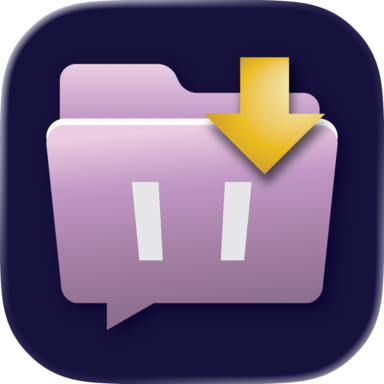
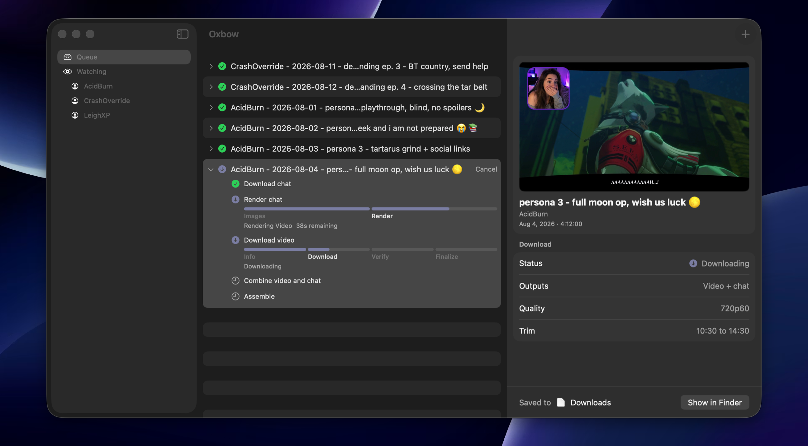

<p align="center">
  
</p>

<h1 align="center">Oxbow</h1>

<p align="center"><strong>Twitch VODs, saved properly. For Mac.</strong></p>

<p align="center">
  <a href="https://github.com/LoftiStudios/oxbow/releases/latest"><strong>Download for macOS</strong></a>
  &nbsp;·&nbsp;
  <a href="https://getoxbow.app">getoxbow.app</a>
  &nbsp;·&nbsp;
  <a href="CHANGELOG.md">Changelog</a>
</p>

<p align="center"><sub>macOS 26+ · Apple Silicon · signed and notarized · MIT</sub></p>

---

*Paste a link, choose whether the chat comes along, and let it run — or hand
Oxbow a channel and let it keep up with that channel for you. Your favorite
streams end up on your Mac, ready for the flight, the commute, or anywhere the
wifi gives up.*



## What it does

**The video.** Best available quality by default, the whole VOD or a trimmed
range, written straight to a folder you choose. Clips too, from any of the
shapes a clip link comes in.

**The chat.** Half of what happened in a stream happened in the chat—the
bits, the spam, the one joke that ran into the ground. It comes along too,
rendered beside the video in a single file, BTTV, FFZ, and 7TV emotes and all.

**Channels it keeps up with.** Twitch deletes VODs, and not on a clock anyone
can read — we measured seven channels and the oldest surviving archive ranged
from 43 days to over nine months, with the streamer's tier predicting nothing
([`docs/twitch-channel-api.md`](docs/twitch-channel-api.md) §6). What is
certain is that a stream you meant to save eventually goes, and there is no
getting it back.

So add a channel. New archives either queue themselves at the settings you
chose when you added it, or wait in a list and tell you they arrived — Oxbow
asks which, because "download everything this person streams" and "tell me,
I'll decide" are different relationships to have with a channel, and you can
change your mind later.

It checks at launch and on a timer while it is open. There is no background
agent, and that is a decision rather than an omission: against a window
measured in months, opening Oxbow every couple of weeks catches everything, and
anyone downloading composites has it open for hours at a time anyway.

Each channel has its own place in the sidebar, with its whole history beneath
it: what you already have, what is still there to fetch, and what went before
you got to it. The last of those is kept behind a line you can open, so a
channel watched for a year is not mostly headstones.

**A queue you can walk away from.** Jobs run in order and expand to show every
step and its progress. The queue survives quitting, and an interrupted
composite continues from where it stopped rather than starting again—a
six-hour job killed at 90% recovers in about twenty minutes, not eighty-eight.

**Names you can read.** Files come out as `{streamer} - {date} - {title}`,
derived from the stream's own metadata and editable before the job starts.

**A way in that isn't the app.** ⌘Space, "Download Twitch Video", paste the
link, Return — the job is queued and Oxbow never comes to the front. It is a
Shortcuts action as well, where `Repeat with Each` over a list of links makes
it a batch intake. Anything you leave blank uses your saved settings rather
than a factory default, so the action and the Settings window cannot disagree
about what you asked for.

**Nothing to install first.** The downloader, the renderer, and FFmpeg are all
inside the bundle. No Homebrew, no Python, no terminal.

Oxbow is young—0.5.0 is a handful of releases in, and there are rough
edges—but every part of it runs end to end today.

## Getting started

1. **Download** the DMG from the
   [latest release](https://github.com/LoftiStudios/oxbow/releases/latest).
2. **Open it and drag Oxbow to Applications.** The app is signed with a
   Developer ID and notarized by Apple, so it opens on a double-click—no
   right-click-to-open, no Gatekeeper detour.
3. **Paste a Twitch link.** A VOD (`twitch.tv/videos/…`) or a clip
   (`twitch.tv/<channel>/clip/…`, `clips.twitch.tv/…`, or a bare slug). Oxbow
   fetches the stream's title, streamer, date, and thumbnail.
4. **Choose what you want.** Just the video, or the video with its chat
   rendered and composited beside it. Pick a quality, trim a range if you only
   want part of it, and choose where it lands.
5. **Add it to the queue and let it run.** Long jobs keep going in the
   background; the composite is readable while it's still being written.
6. **Or add a channel instead.** Same window, the `+` on the Watching pane.
   Oxbow checks it from then on and either queues what it finds or tells you
   it is there — your choice when you add it, changeable afterwards.

## Requirements

- **macOS 26 or later.**
- **Apple Silicon.** Oxbow is arm64 only — Intel Macs are not supported. See
  "Scope trims for v1" in [`docs/architecture.md`](docs/architecture.md).

## Not affiliated with Twitch

Oxbow is an independent project with no affiliation with, endorsement by, or
sponsorship from Twitch Interactive, Inc. Twitch and the Twitch logo are
trademarks of Twitch Interactive, Inc., used here only to describe what the app
does. Downloaded video and chat remain the property of their respective rights
holders — please respect their copyright and Twitch's terms of service.

## Building

If you are only working on `OxbowKit` — the queue engine, argument builder,
output parser, and persistence layer — you need Xcode and nothing else:

```bash
git clone https://github.com/LoftiStudios/oxbow.git
cd oxbow
swift test
```

Building the **app bundle** needs more. Start with the submodule:

**Clone with submodules.** `vendor/TwitchDownloader` is a git submodule pinned
to an exact commit. A plain `git clone` leaves it empty and the build will fail
confusingly. It points at a mirror of upstream rather than at
`lay295/TwitchDownloader` directly — the mirror carries upstream's own history
unmodified plus tags that keep a pinned commit fetchable, and Oxbow adds no
code to it. See "submodule pin policy" in [`docs/development.md`](docs/development.md).

```bash
git clone --recurse-submodules https://github.com/LoftiStudios/oxbow.git
```

Already cloned without it:

```bash
git submodule update --init --recursive
```

Then you need the [.NET 10 SDK](https://dotnet.microsoft.com/download)
(`brew install --cask dotnet-sdk`) and Xcode. Build the bundled FFmpeg — an
LGPL, arm64, hardware-encoding build we compile ourselves because every
readily-available macOS binary is GPL:

```bash
./scripts/build-ffmpeg.sh
```

Full command reference is in [`docs/development.md`](docs/development.md); the contributor-facing
version is in [`CONTRIBUTING.md`](CONTRIBUTING.md).

Note that a local build is unsigned. Signing and notarization need a Developer
ID certificate tied to a specific Apple Developer account, so only the
maintainer can cut a distributable release.

## Contributing

Contributions are welcome — see [`CONTRIBUTING.md`](CONTRIBUTING.md). Most
changes only need `swift test` and no .NET or FFmpeg toolchain at all.

Architectural decisions and their rationale live in
[`docs/architecture.md`](docs/architecture.md), including a "Do not suggest" list of
things already considered and rejected.

Security issues should be reported privately — see [`SECURITY.md`](SECURITY.md).

## Licensing

Oxbow is [MIT](LICENSE). It bundles two other things:

- **TwitchDownloaderCLI** (MIT) — see `vendor/TwitchDownloader/LICENSE.txt`
- **FFmpeg** (LGPL 2.1+) — unmodified, built by `scripts/build-ffmpeg.sh`,
  which emits `COPYING.LGPLv2.1` and `FFMPEG-SOURCE.txt` recording the exact
  source and configure line so the binary can be reproduced.

See [`docs/ffmpeg.md`](docs/ffmpeg.md) for why we build FFmpeg ourselves.

## Third Party Credits

Downloads and chat rendering are performed by
[TwitchDownloaderCLI](https://github.com/lay295/TwitchDownloader) © lay295 and
contributors, bundled as a helper executable. Oxbow exists because upstream
ships a Windows WPF app and a cross-platform CLI, leaving Mac users with the
CLI only.

Video is encoded and finalized with [FFmpeg](https://ffmpeg.org/) © The FFmpeg
developers, built from unmodified source under LGPL 2.1+.

The bundled helper is a self-contained
[.NET](https://github.com/dotnet/runtime) application © Microsoft Corporation.

Chat renders are drawn with [SkiaSharp and HarfBuzzSharp](https://github.com/mono/SkiaSharp)
© Microsoft Corporation, and may use
[Noto Color Emoji](https://github.com/googlefonts/noto-emoji) © Google and
contributors or [Twemoji](https://github.com/jdecked/twemoji) © Twitter and
contributors, by way of TwitchDownloaderCLI.

For the full set of libraries reaching Oxbow through the bundled helper, see
upstream's
[THIRD-PARTY-LICENSES.txt](https://github.com/lay295/TwitchDownloader/blob/master/TwitchDownloaderCore/Resources/THIRD-PARTY-LICENSES.txt).
